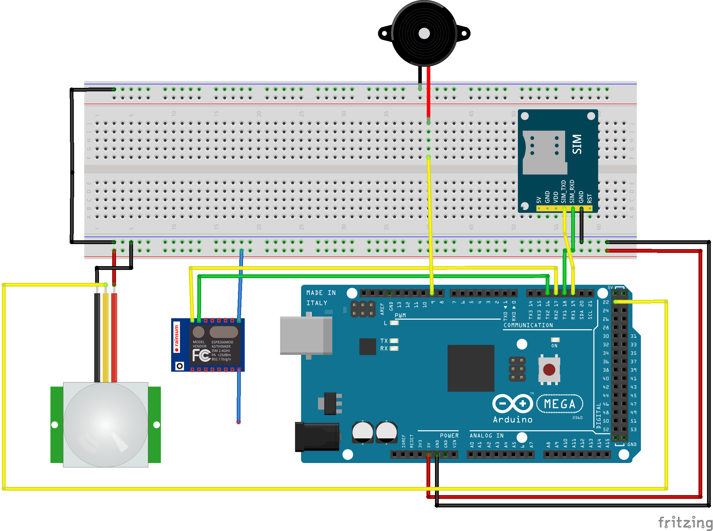

# Project-Falcon
<b>SMS System Notifier</b>

Falcon receives text from anyone and alerts everyone on the house by creating a buzz/noise. Everytime a person is detected by Falcon (Using Motion Sensor), it checks if the message received is still unread and buzz again and again until they read the message.

<b>Parts I've used:</b>

<ul>
<li>Arduino Mega 2560</li>
<li>Wifi Prototype ESP8266 (from EasyElectronyx)</li>
<li>SIM900A GSM Module</li>
<li>Buzzer</li>
<li>PIR Motion Sensor</li>
</ul>

<b>Schematics:</b>

<b>Special Thanks to:</b>

Ardin Hajihil - A very nice guy :D
  

EasyElectronyx - Thanks to their products to make this project successful

<a href='https://easyelectronyx.com/'>Website - EasyElectronyx</a>

<a href='https://www.facebook.com/easyelectronyx/'>Facebook Page - EasyElectronyx</a>

